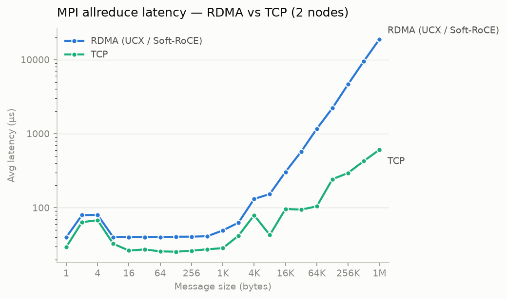

# ai-fabric-lab

Building, measuring and debugging an RDMA/RoCE network fabric for distributed AI
workloads on two VMs, from the kernel module up to MPI collectives.

**TL;DR:** I built a two-node RDMA fabric with Soft-RoCE, ran the same MPI
`allreduce` benchmark over RDMA and over TCP on the same link, and debugged a
real cross-layer failure (OpenMPI + UCX + Soft-RoCE refusing to talk to each
other) down to a kernel driver behavior, by testing every layer of the stack in
isolation.

## Why this lab

When you train a model on several machines, every node computes gradients, and
all nodes must agree on their average before the next step. That operation is
called **allreduce**, and it runs on the network at every single training step.
At scale, the network becomes the bottleneck. This is why AI datacenters use
**RDMA** (Remote Direct Memory Access): one machine reads/writes the memory of
another directly, without the CPU and the OS sitting on the data path.

This lab is a small-scale reproduction of that networking path: RDMA/RoCE
bring-up, MPI collectives, transport selection, and benchmark collection on two
VMs.

## Setup

Two Ubuntu Server VMs on a KVM/libvirt host, connected by a private isolated
network (plus a separate NAT network for management):

```
host (Ubuntu + KVM/libvirt)
 |
 |--> node1 : enp2s0 = 10.0.0.1 --> rxe0 (Soft-RoCE device)
 |--> node2 : enp2s0 = 10.0.0.2 --> rxe0 (Soft-RoCE device)
       ^
       '-- private bridge 10.0.0.0/24, dedicated to the fabric
```

**Soft-RoCE** (kernel module `rdma_rxe`) implements RoCEv2 in software on top of
a normal Ethernet NIC. RoCEv2 is RDMA encapsulated in UDP port 4791, which is
what real AI datacenters deploy. The API and all the tools are identical to
hardware RDMA. Only the performance is not, since every packet still goes
through the kernel. That trade-off is the whole point: you get the real stack,
the real tooling and the real failure modes, on any machine.

```
sudo modprobe rdma_rxe
sudo rdma link add rxe0 type rxe netdev enp2s0
```

## Step 1: Bring up RDMA and prove it works

Bottom layer first. Both nodes expose an active RDMA device (`ibv_devinfo`:
`PORT_ACTIVE`), `rping` proves two-way RDMA connectivity, and `perftest` gives
the first real numbers:

```
rping / ib_send_lat / ib_write_bw
  --> libibverbs (the RDMA API)
    --> rxe0 (Soft-RoCE)
      --> enp2s0
        --> 10.0.0.0/24 --> other node
```

| Test (initial validation run) | What it measures | Result |
|---|---|---|
| `ib_send_lat` | two-sided send latency (2 B) | ~22 µs |
| `ib_write_bw` | one-sided RDMA WRITE bandwidth (64 KiB) | ~90 MB/s |
| `ib_read_bw` | one-sided RDMA READ bandwidth (64 KiB) | ~132 MB/s |

"One-sided" is the interesting part of RDMA: the initiator writes directly into
a registered memory region of the remote machine; the remote CPU does nothing.

## Step 2: Put MPI on top

**MPI** is the standard API of HPC: the same binary is launched on N nodes, each
copy gets a rank, and they communicate through operations like `allreduce`. The
OSU Micro-Benchmarks measure the cost of those operations. First lesson learned
here: the default OpenMPI run silently picked the NAT management network, so the
benchmark had to be pinned to the fabric explicitly. Trust flags, not defaults,
then verify.

The working TCP path:

```
osu_allreduce
  --> OpenMPI (ob1 + TCP, forced on enp2s0)
    --> kernel TCP stack
      --> enp2s0 --> 10.0.0.0/24
```

## Step 3: The challenging part, MPI over RDMA fails

The goal was to run the same benchmark through **UCX**, the communication
framework OpenMPI uses to reach RDMA devices:

```
osu_allreduce
  --> OpenMPI
    --> UCX
      --> libibverbs
        --> rxe0 --> enp2s0        <-- intended path
```

It failed during MPI startup, with a fatal `UD endpoint ... unhandled timeout
error`. The frustrating paradox:

- RDMA alone worked (`rping`, `perftest`).
- MPI alone worked (OSU over TCP).
- UCX *saw* the RDMA device (`ucx_info -d` listed `rxe0`).
- All three together: crash.

### Isolating the failure, layer by layer

Rather than trying random flags, each suspect was tested alone:

| # | Question | Test | Verdict |
|---|---|---|---|
| 1 | Is the kernel UD path broken? | `ib_send_lat -c UD` at every message size | works, kernel exonerated (at first) |
| 2 | Is OpenMPI the problem? | `ucx_perftest` alone reproduces the exact crash | OpenMPI exonerated |
| 3 | Do packets leave / arrive? | `tcpdump` on UDP 4791 during the failure | they flow both ways, well-formed (correct QP numbers, correct keys), retransmitted for 30 s, and ignored |
| 4 | Does UCX receive anything? | `UCX_LOG_LEVEL=debug` | zero packets ever delivered to UCX |

So: valid packets reach the destination NIC and vanish before reaching the
application. That narrows it to the receive path of the `rxe` driver itself.

```
what works:   ib_send_lat (UD) --> verbs --> rxe0     OK
what fails:   ucx_perftest (UD) --> verbs --> rxe0    timeout
              same transport, same wire  -->  the difference is in what
              the two programs READ from the received packet
```

The difference: with an IPv4 RoCEv2 address there is no GRH (the RDMA routing
header) on the wire. The receiving driver must *reconstruct* it from the IP
header. `perftest` never looks at that reconstructed header; **UCX validates
it**. On this kernel (6.8), the rxe driver's RoCEv2/IPv4 receive path never
delivers usable packets to UCX, so connection setup retries for 30 seconds and
dies.

**The fix/workaround**: use the IPv6 link-local RDMA address (GID index 0)
instead of the IPv4 one. The wire format becomes RoCEv2 over IPv6, where the
routing header maps directly, and everything immediately works:

```bash
mpirun -np 2 --host node1,node2 --mca pml ucx \
  -x UCX_TLS=rc_verbs,ud_verbs,self,sm \
  -x UCX_NET_DEVICES=rxe0:1 \
  -x UCX_IB_GID_INDEX=0 \
  ./osu_allreduce
```

```
osu_allreduce
  --> OpenMPI
    --> UCX (rc_verbs data path, ud_verbs connection setup)
      --> libibverbs
        --> rxe0 --> enp2s0 --> 10.0.0.0/24      <-- now completes, 1 B to 1 MiB
```

No TCP transport is even available to UCX in that command. The data path is
RDMA by construction.

## Step 4: Measure the same allreduce, two transports

`scripts/run_benchmarks.py` runs the whole campaign over SSH (perftest sweeps +
OSU latency/bandwidth/allreduce on both transports) and writes timestamped CSVs
to `results/csv/`. `scripts/plot.py` turns the latest run into the plots below
and a short report.



| Metric (same link, same binary) | RDMA (Soft-RoCE) | TCP |
|---|---|---|
| Point-to-point latency, 8 B | 25 µs | 21 µs |
| Point-to-point bandwidth, 1 MiB | 107 MB/s | 5 911 MB/s |
| Allreduce latency, 1 MiB | 18.8 ms | 0.6 ms |

**TCP wins here, and that is the expected result.** Soft-RoCE is RDMA
*in software*: every "RDMA" packet still crosses both kernels, while the VMs'
paravirtualized TCP path benefits from years of kernel optimization and virtio
offloads. The two properties that make RDMA dominant on real hardware, NIC
offload and kernel bypass, are precisely the two things a software
implementation cannot give. What this lab demonstrates is the full HPC stack
(OSU --> OpenMPI --> UCX --> verbs --> RoCEv2) running end-to-end, measured on
both transports over the same link, with the numbers to prove which layer costs
what.

## Reproduce

```bash
# on each VM (not persistent across reboots):
sudo modprobe rdma_rxe && sudo rdma link add rxe0 type rxe netdev enp2s0

# from the host:
python3 scripts/run_benchmarks.py     # perftest + OSU, both transports --> results/csv/

# plotting needs matplotlib (one-time setup):
python3 -m venv .venv && .venv/bin/pip install matplotlib
.venv/bin/python scripts/plot.py      # --> plots/ + docs/benchmark-report.md
```

## Known limits 

- Soft-RoCE latencies are not representative of hardware RDMA: same API, same
  tools, software data path.
- No lossless Ethernet: real RoCE fabrics rely on PFC and ECN because RDMA
  tolerates packet loss very badly, not deployed here.
- The RoCEv2/IPv4 receive-path issue is worked around (IPv6 GID).

## Further reading

- [VM setup](docs/setup-vms.md): KVM/libvirt network, cloud-init, static IPs,
  SSH, and storage notes.
- [RDMA validation](docs/rdma.md): Soft-RoCE bring-up, `ibv_devinfo`, `rping`,
  and first `perftest` results.
- [MPI and UCX](docs/mpi.md): OpenMPI, OSU Micro-Benchmarks, transport
  selection, UCX troubleshooting, and the GID workaround.
- [Benchmark report](docs/benchmark-report.md): generated plots and summary
  numbers from the latest benchmark campaign.

## Roadmap

Ansible provisioning of the fabric, Prometheus/Grafana on the RDMA counters,
RoCEv2 packet dissection in Wireshark (BTH headers on UDP 4791), and a
troubleshooting runbook built from deliberately provoked failures.


## note

This lab was built as a learning project. AI assistance was used to support the writing of the report, to help learn the core HPC concepts, and to assist with scripting.
