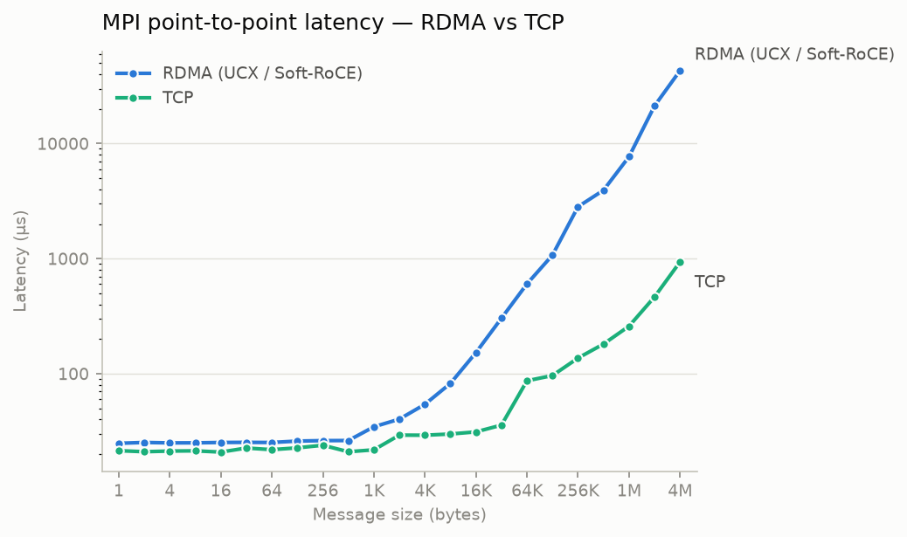
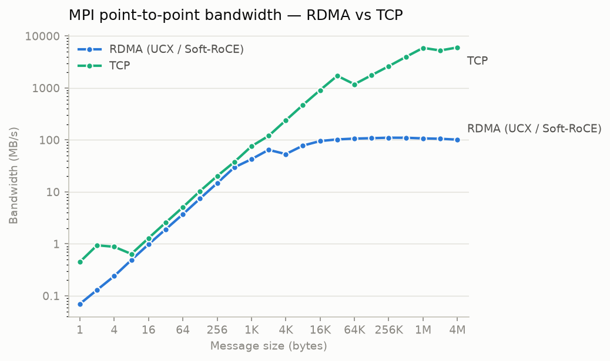
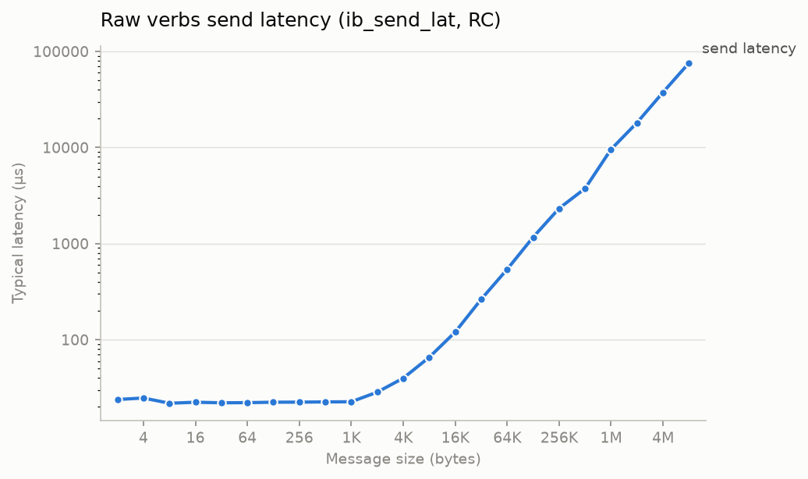
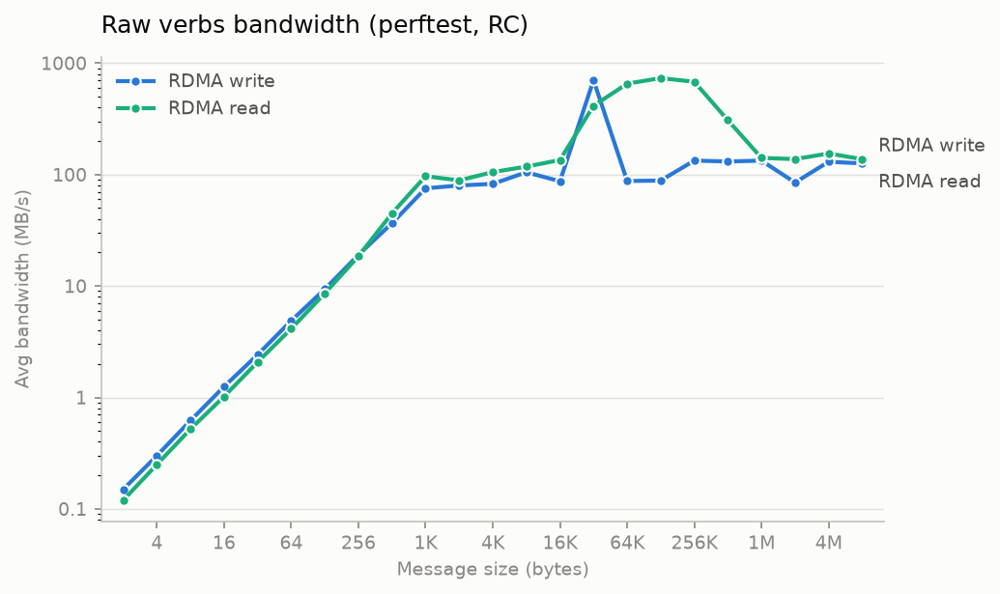

# Benchmark report — MPI over RDMA vs TCP

Generated by `scripts/plot.py` on 2026-07-02 from `results/csv/20260702-194513`.

Two KVM VMs, private 10.0.0.0/24 link (`enp2s0`), Soft-RoCE (`rxe0`).
Same `osu_allreduce` binary, two transports on the same physical path:

- **RDMA**: OpenMPI → UCX → `rc_verbs` → `rxe0` (`UCX_IB_GID_INDEX=0`, see `docs/mpi.md`)
- **TCP**: OpenMPI → OB1 → TCP BTL → `enp2s0`

## Headline numbers

| Metric | RDMA | TCP | Unit |
|---|---|---|---|
| Point-to-point latency (8 B) | 25.1 | 21.4 | µs |
| Point-to-point bandwidth (1 MiB) | 107.2 | 5,911.4 | MB/s |
| Allreduce latency (8 B) | 40.0 | 32.6 | µs |
| Allreduce latency (64 KiB) | 1,163.1 | 104.3 | µs |
| Allreduce latency (1 MiB) | 18,815.6 | 605.9 | µs |

## Allreduce — the RDMA vs TCP comparison

## Point-to-point

## Raw verbs baseline (perftest)

## Reading the results

Soft-RoCE is RDMA implemented *in software* inside the kernel: every
"RDMA" packet still crosses the kernel of both VMs, plus the UDP
encapsulation of RoCEv2. It therefore does not get the two things
that make hardware RDMA fast (NIC offload and kernel bypass), and the
kernel TCP stack is heavily optimized. Seeing TCP win or tie at small
message sizes is expected in this lab; the point of the exercise is
that the full HPC software stack (OSU → OpenMPI → UCX → verbs →
RoCE) runs end-to-end and can be measured on both transports over
the same link.
